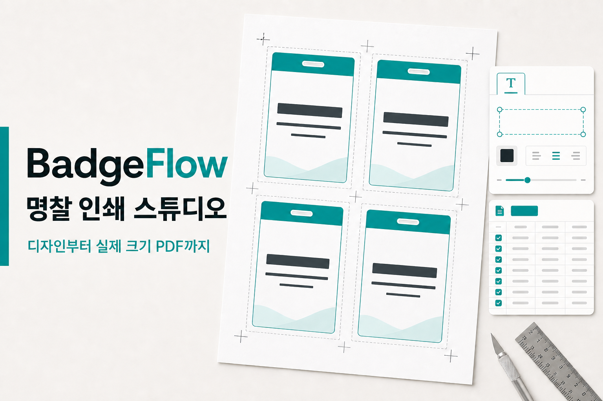

# BadgeFlow

브라우저에서 명찰을 디자인하고 CSV 데이터를 연결해 실제 크기 인쇄용 PDF를 만드는 오픈소스 도구입니다.

[웹 앱 실행](https://badgeflow-studio.silverhyeok-dev.chatgpt.site/) · [GitHub Pages 미러](https://eunhyeokjung.github.io/badgeflow/) · [최신 릴리스 다운로드](https://github.com/EunHyeokJung/badgeflow/releases/latest) · [English README](README.en.md)



## 주요 기능

- 95 × 123 mm 목걸이 명찰, A7, B7, CR80 등 대표 규격으로 바로 시작
- A3, A4, Letter 및 사용자 지정 출력 용지
- 텍스트, 매개변수 텍스트, PNG/JPG/WebP/SVG 이미지 레이어
- 드래그 앤 드롭, 키보드 이동, 정렬, 레이어 순서, 잠금, 숨김, 실행 취소
- 가로·세로 중앙 정렬 버튼과 중앙 자석 스냅 가이드
- CSV 업로드 또는 표 직접 편집
- 재단선, 외곽선, 간격, DPI를 반영한 실제 크기 PDF
- 이미지와 데이터를 포함하는 프로젝트 백업/복원
- IndexedDB 자동 저장과 localStorage 폴백
- 한국어, English, 日本語, 简体中文, 繁體中文, Español, Français, Deutsch UI
- 데스크톱·모바일 홈 화면에 설치할 수 있는 오프라인 지원 PWA

업로드한 이미지와 CSV는 서버로 전송하지 않습니다. 디자인, 자동 저장, PDF 생성은 브라우저 안에서 처리됩니다.

## 앱 설치

BadgeFlow는 별도 앱 스토어 없이 설치하는 PWA입니다.

1. [BadgeFlow 웹 앱](https://badgeflow-studio.silverhyeok-dev.chatgpt.site/)을 Chrome, Edge 또는 Safari로 엽니다.
2. 상단의 **앱 설치**를 누릅니다. 버튼이 보이지 않으면 브라우저 메뉴의 **앱 설치** 또는 **홈 화면에 추가**를 선택합니다.
3. 설치 후에는 앱 창과 홈 화면 아이콘으로 실행할 수 있으며, 한 번 연 화면은 네트워크가 불안정해도 다시 열 수 있습니다.

언어는 상단 메뉴에서 즉시 변경할 수 있습니다. 번역되지 않은 새 문구는 영어로 안전하게 폴백합니다. CSV 열 이름과 명찰에 들어가는 실제 데이터는 언어 변경 시 자동 번역하지 않습니다.

## 빠른 시작

요구 사항:

- Node.js 22.13 이상
- npm 10 이상

```bash
git clone https://github.com/EunHyeokJung/badgeflow.git
cd badgeflow
npm ci
npm run dev
```

개발 서버가 출력한 로컬 주소를 브라우저에서 여세요.

## 명령어

```bash
npm run dev        # 로컬 개발 서버
npm run lint       # Biome 정적 분석
npm run typecheck  # TypeScript 검사
npm test           # 프로덕션 빌드 + 렌더링 통합 테스트
npm run check      # lint + typecheck + test
npm run build      # 프로덕션 빌드
npm run build:pages # GitHub Pages용 정적 export
npm run start      # 빌드 결과 로컬 실행
```

## 지원 범위와 안전 제한

| 항목 | 지원 및 제한 |
| --- | --- |
| 이미지 | PNG, JPEG, WebP, SVG · 파일당 최대 10MB |
| CSV | UTF-8 권장 · 최대 5MB, 500행, 50열 |
| 프로젝트 | `.badgeflow.json` · 최대 30MB |
| PDF | 150, 300, 600 DPI |
| 저장 | IndexedDB 우선, localStorage 폴백 |

SVG는 스크립트, 외부 리소스 참조, 위험한 CSS를 제거한 뒤 사용합니다. 프로젝트 import도 허용된 데이터 URL과 유효한 수치 범위만 받아들입니다.

## 구조

```text
app/                 Next.js App Router, 메타데이터, 오류 화면
components/          BadgeFlow 편집기 UI와 PDF 렌더링
lib/badgeflow/       브라우저 저장소 어댑터
worker/              Cloudflare Worker 엔트리와 보안 헤더
tests/               서버 렌더링 및 배포 계약 테스트
docs/                아키텍처 문서
```

상세한 데이터 흐름과 신뢰 경계는 [아키텍처 문서](docs/ARCHITECTURE.md), 번역 추가 방법은 [다국어 가이드](docs/I18N.md)를 참고하세요.

## 배포

기본 프로덕션은 vinext를 사용해 Next.js App Router를 Cloudflare Worker 런타임으로 빌드합니다. `main` 브랜치에 푸시하면 [GitHub Pages 미러](https://eunhyeokjung.github.io/badgeflow/)도 별도 Actions 워크플로로 정적 export되어 배포됩니다.

```bash
npm ci
npm run check
npm run build
npm run build:pages
```

기본 호스팅 환경에는 정적 에셋을 제공하는 `ASSETS` 바인딩이 필요합니다. GitHub Pages 빌드는 `/badgeflow/` base path를 적용해 PWA manifest, 아이콘, 서비스 워커까지 하위 경로에서 동작합니다. Worker가 추가하는 보안 응답 헤더는 기본 배포에만 적용됩니다. 플랫폼별 비밀 값은 저장소에 커밋하지 마세요.

## 기여

버그 수정과 기능 제안을 환영합니다. 작업 전 [기여 가이드](CONTRIBUTING.md), [행동 강령](CODE_OF_CONDUCT.md), [보안 정책](SECURITY.md)을 읽어 주세요.

## 라이선스

[MIT](LICENSE) © EunHyeokJung
